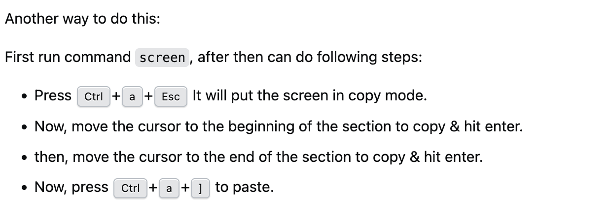

# Additional Tutorials

These additional tutorials that we developed when working in a minimal set-up such as Raspberry Os lite, which it does not have any GUI, only terminal. For a better experience, we recommend the following tools:

## TMUX

**Instalation**
To install do:

```
sudo apt install tmux
```

**Basic Usage**

This is to initialize the session

```
tmux
```

Split Horizontally

```
Ctrl + b, "
```

Split vertically

```
Ctrl + b, %
```

Switch between panes

```
Ctrl + b, arrow key
```

close a pane

```
Ctrl + d
```

## SCREEN

This is to copy and paste stuff in the terminal.
**Install**

```
sudo apt install screen
```

screen



these are the instructions

## how to mount and unmount a drive

Do:

```
sudo mkdir -p /mnt/usb
```

then:

```
sudo mount /dev/sda1 /mnt/usb
```

Usually, the usb is mounted on `dev/sda1`. Then to copy from the usb to somewhere, do the following:

```
cp /mnt/usb/file ~/Documents/ -> This is for files
cp -r /mnt/usb/docs/ ~/Documents/ -> folders
```

To unmount:

```
sudo umount /mnt/usb
```
