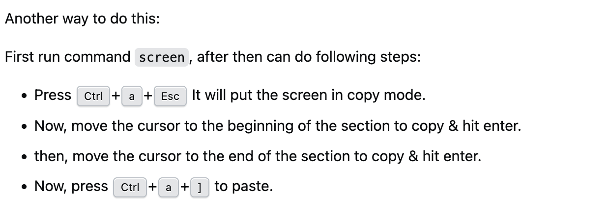

# Additional Tutorials

These additional tutorials are for the terminal, navigation.

## TMUX

**Instalation**

```
sudo apt install tmux     # Ubuntu/Debian
sudo yum install tmux     # CentOS/RHEL
brew install tmux         # macOS
```

**Basic Usage**

This is to initialize the session

```
tmux
```

Split Horizontally

```
Ctrl + b, "
```

Split vertically

```
Ctrl + b, %
```

Switch between panes

```
Ctrl + b, arrow key
```

close a pane

```
Ctrl + d
```

## SCREEN

**Install**

```
sudo apt install screen
```

screen



these are the instructions

## how to mount and unmount a drive

first, run:

```

lsblk

```

then lookf for a line like:

```

/dev/sdb1 16G 4G 12G 25% /media/username/USB_NAME

```

then :

```

sudo mkdir -p /mnt/usb

```

then:

```

sudo mount /dev/sda1 /mnt/usb

```

Now its time to copy:This is for all files

```

cp -r /media/pi/MyUSB/\* ~/Documents/

```

to unmount:

```

sudo umount /mnt/usb

```

```

```
